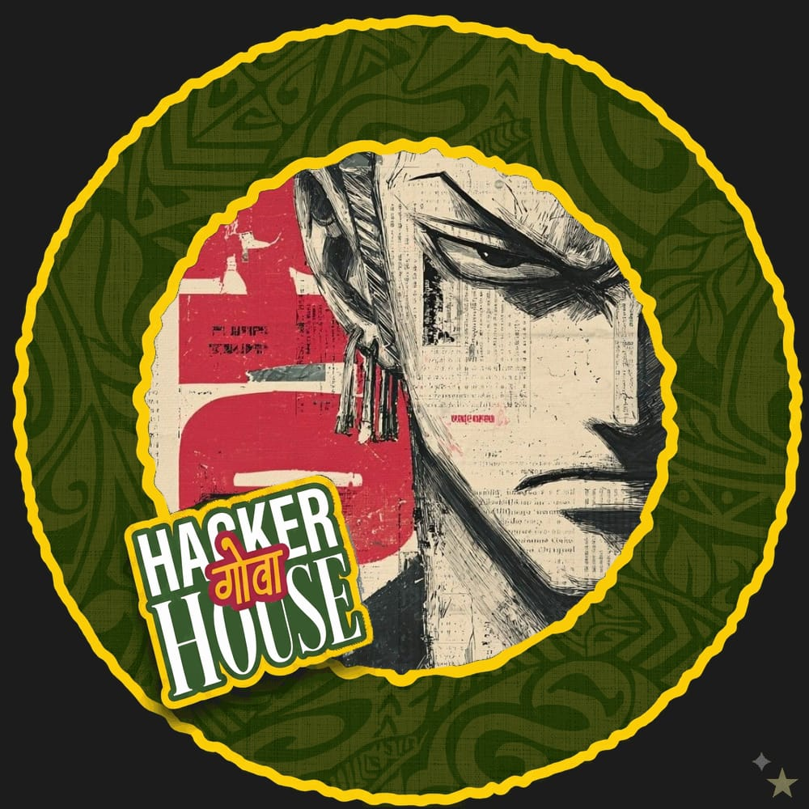
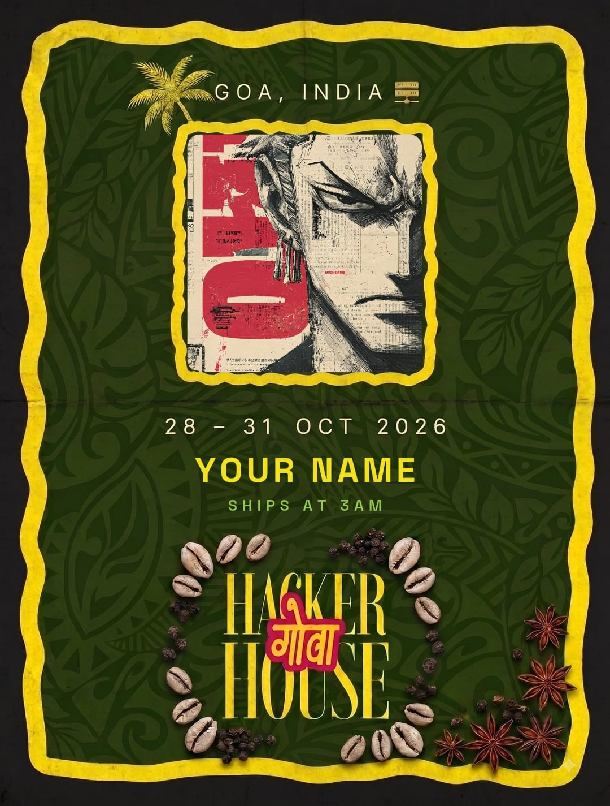

# HH Goa 2026 — Frame / Builder ID Generator

Shortlisting task 1. Upload a photo, get a branded HH Goa 2026 graphic, download it
or post it to X. No login, no signup gate, one pass start to finish.

Live: **https://hhgoa-frame-generator-sepia.vercel.app**

## What it makes

Both outputs below are real exports from the app, at the exact pixel sizes it
writes. The app hands you PNG; these are stored as JPEG to keep the repo light.

| Format A — PFP frame | Format B — Builder ID card |
|---|---|
|  |  |
| **1000×1000**, square. Sized for an X / Discord / GitHub avatar — drop it in as-is. | **1080×1425**, portrait. The printed HH Goa key-art poster with your photo in its window. |

- **Format A — PFP frame**: 1000×1000. The photo fills a circular well, the
  scalloped yellow ring and tapa-cloth field wrap it, and the `HACKER गोवा
  HOUSE` sticker sits bottom-left. Crops round, so it survives every platform
  that masks avatars into a circle.
- **Format B — Builder ID card**: 1080×1425. Torn yellow border, tapa-cloth
  green field, the palm and `GOA, INDIA` header, the wavy photo window,
  `28 – 31 OCT 2026`, and the `HACKER गोवा HOUSE` wordmark inside its
  cowrie-and-star-anise wreath. Your name, stack and generated builder class sit
  between the dates and the wreath — the only block the poster itself does not
  have. The sample shows the untouched empty state, so it reads `YOUR NAME` and
  the placeholder class `SHIPS AT 3AM`; typing a name and stack replaces both.

Both are drawn on a client canvas at full export resolution — what the preview
shows is the file you get, not a scaled proxy.

## Run it

```bash
npm install
npm run dev      # http://localhost:3000
npm test         # crop maths, title generator, generated art
```

## Deploy

Already deployed at
[hhgoa-frame-generator-sepia.vercel.app](https://hhgoa-frame-generator-sepia.vercel.app),
with this repo connected — a push to `main` ships production. From scratch:

```bash
npx vercel link   # link the project
npx vercel --prod
```

Then add a **Blob** store in the Vercel dashboard (Storage → Create → Blob) and
redeploy. That gives `BLOB_READ_WRITE_TOKEN`, which powers the share-link preview.
See `.env.example`.

## How the brief maps to the code

Requirements are the ones published on [hhgoa.com](https://hhgoa.com/) for
Task #1 — HH Goa Frame / ID Card Generator.

| Requirement | Where |
|---|---|
| Upload jpg / png / webp / **HEIC** | `lib/render.js` → `decodeFile`. `createImageBitmap` first; the HEIC converter is dynamically imported only when a HEIC actually shows up, so nobody else pays for it. EXIF rotation via `imageOrientation: 'from-image'`. |
| Near-instant | Everything renders on a client canvas. The SVG ornaments are decoded once and cached, so typing in the name field re-renders in ~10 ms. Nothing round-trips a server to make the image. |
| Handles real photos | `coverRect` centre-crops to fill any aspect ratio, biased upward so portrait shots don't get beheaded — with a tighter bias on the PFP, whose top band would otherwise eat the head. |
| Downloadable output | `canvas.toBlob` → real PNG file on disk. |
| Share to X, pre-filled | `POST /api/share` stores the PNG in Vercel Blob and returns an id. The button opens `x.com/intent/post` with the caption and a link to `/f/<id>`. |
| Link preview shows the graphic | `app/f/[id]/page.js` sets `og:image` / `twitter:image` to the stored PNG, `summary_large_image`. |
| Share works even if the store is down | `shareToX` in `app/page.js` tries the native share sheet first (phones get the PNG attached to the post). Failing that, an upload error — or a localhost / LAN origin X could never crawl — drops the link and the composer opens with the caption plus a note to attach the PNG by hand. The post still happens; only the preview card is lost. |
| `#FrameInGoa` | In the caption constant in `app/page.js`. |
| Mobile-friendly | Single-column, 16px inputs (no iOS zoom), tap-anywhere dropzone, `accept="image/*"` opens the camera roll. |
| Instantly recognisable branding | Format B is the key-art poster itself, redrawn as vectors: same palette, same border, same wordmark-in-a-wreath lockup. |
| Personalisation: name, stack, builder class | `lib/render.js` → `drawCard`. The class comes from `builderTitle`, hashed off name+stack so it never rerolls on a typo fix. Stack and class share a line, and split onto two when they would overrun. |

## Layout

```
lib/brand.js     palette, fonts, event copy
lib/render.js    canvas pipeline for both formats, file decoding, crop maths
public/          the two frame plates (pfp-frame.png, card-frame.png) the
                 canvas composites the photo behind, plus landing art
tools/cut-*.py   one-off scripts that cut those plates out of the key-art
app/Landing.js   the sun-burst landing overlay (CSS animation, no JS library)
app/page.js      the whole tool UI — tabs, dropzone, crop dialog, share
app/api/share/   PNG → Vercel Blob (tmp-dir fallback when no token)
app/f/[id]/      share landing page whose OG image is the generated graphic
docs/            the two sample exports shown above
```

Everything renders in the browser: `1000×1000` and `1080×1425` canvases,
composited against pre-cut frame plates so no ornament has to be redrawn per
keystroke. Production build is 7.3 kB for the page, 110 kB first load JS.

## Not built yet

The brief also asks for a **combined frame with your teammates** — one graphic
holding several builders. Single-photo generation is done; the multi-photo
layout is not.

## Known ceilings

- Blobs are never garbage-collected — fine for a hackathon, add a TTL sweep if
  this outlives the event.
- Without `BLOB_READ_WRITE_TOKEN` the PNG is parked in the serverless tmp dir,
  which the next instance does not share: the share link 404s for everyone else.
  Downloads are unaffected. Set the token before sharing links in anger.
- `POST /api/share` with a malformed body answers `500`, not `400` —
  `request.formData()` throws before the guard runs.
